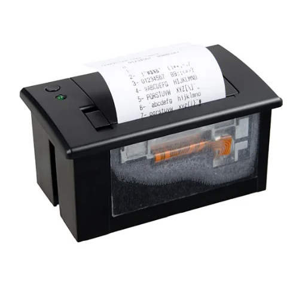
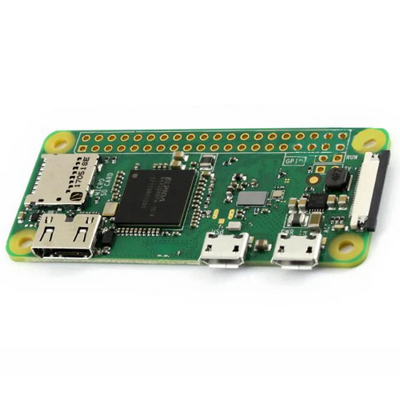
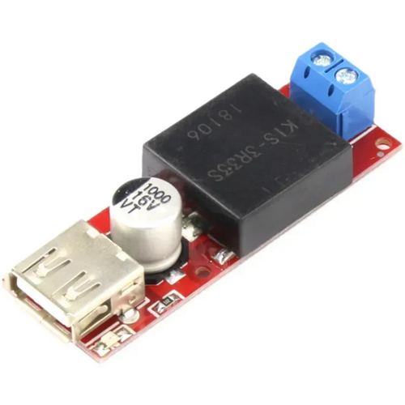
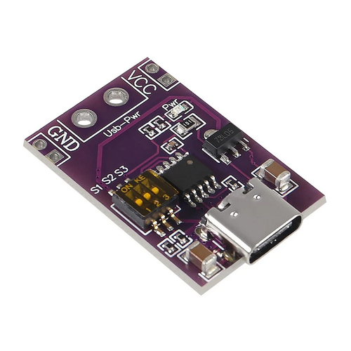
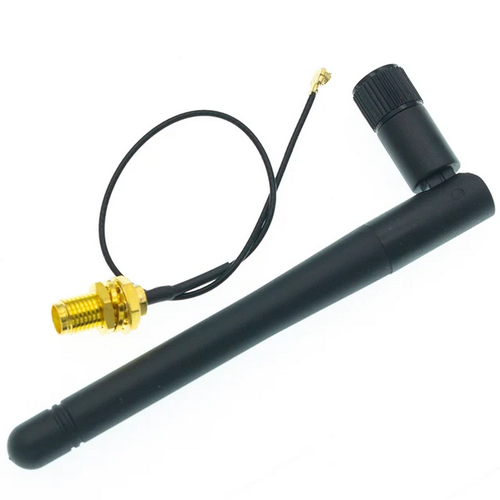
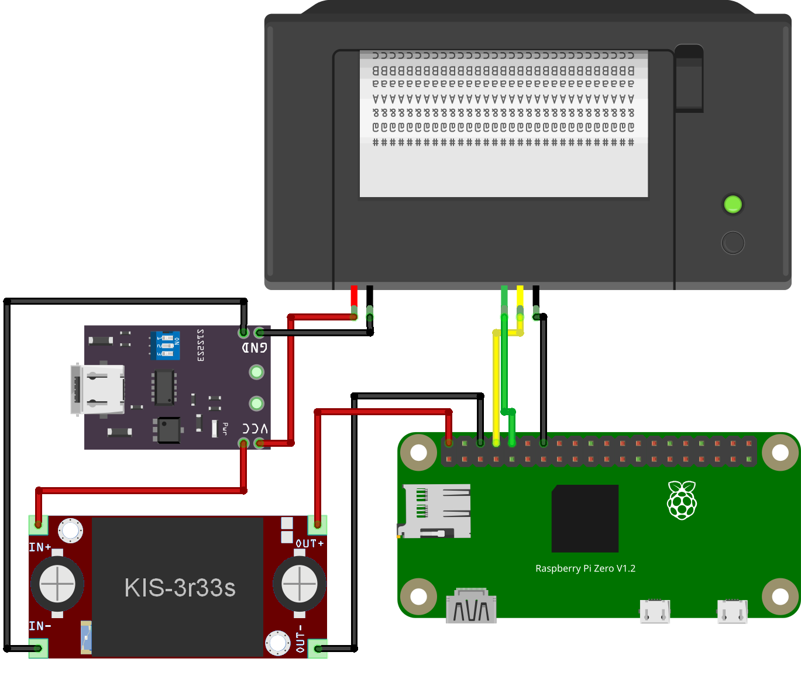
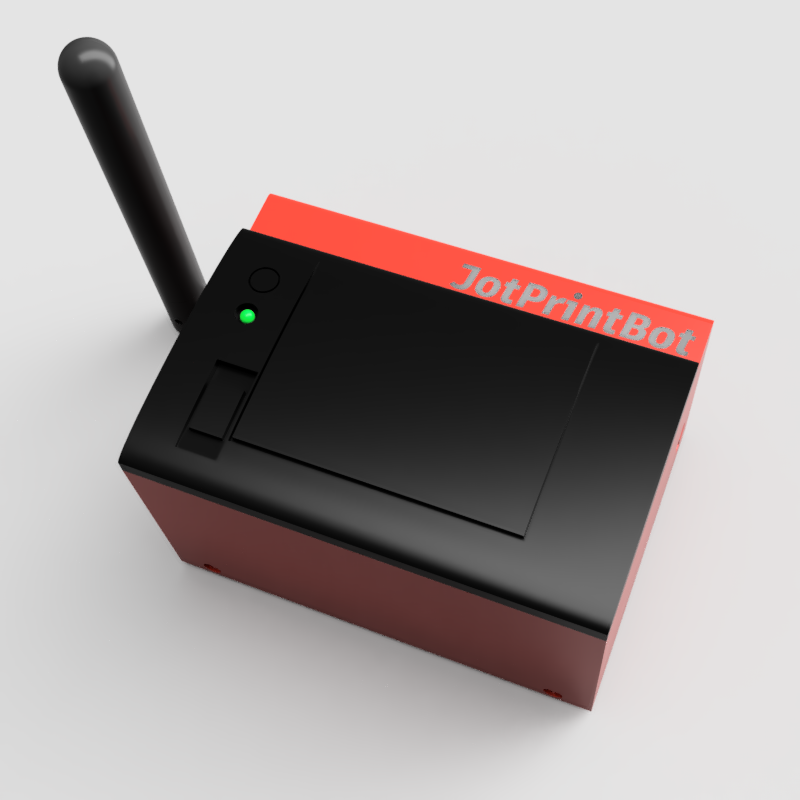
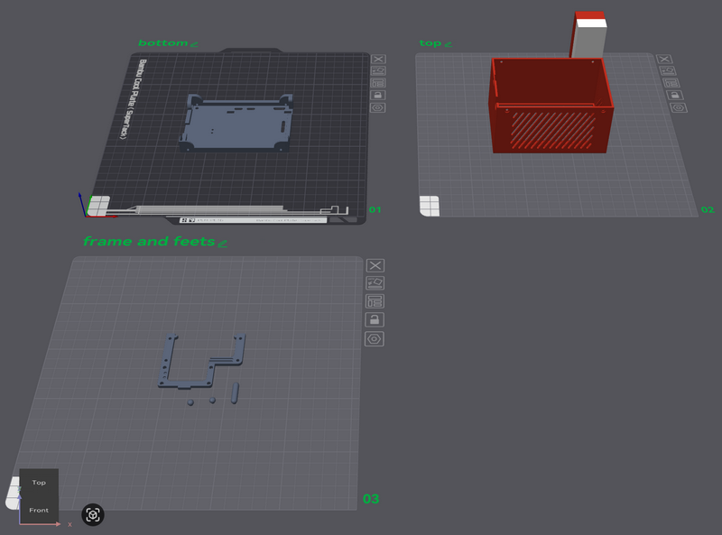

# Assembly Instructions

This guide describes how to build a portable JotPrintBot setup using a CSN-A2 thermal printer, Raspberry Pi Zero W, and a USB Type-C PD power path. Follow the steps in order and observe polarity and voltage ratings.

> **Safety:** Double-check polarity before applying power. The Raspberry Pi GPIO has no reverse-polarity protection. Use a Quick Charge / PD power supply that supports 12 V output via the trigger module.

---

## BOM (Bill of Materials)

### Electronics

| # | Component                        | Photo                                           | Info / Links                                                                                                |
| --- | ------------------------------------------- | ---------------------------------------------------- | ------------------------------------------------------------------------------------------------------------------------------------ |
| 1 | CSN-A2 Micro panel printer                |    | ESC/POS, 9V/12V / [Manual](https://cdn-shop.adafruit.com/datasheets/CSN-A2+User+Manual.pdf) / [Shop Ali](https://ali.click/gpp8018) |
| 2 | Raspberry Pi Zero W                       |                | [PDF](https://cdn.sparkfun.com/assets/learn_tutorials/6/7/6/PiZero_1.pdf) / [Shop Ali](https://ali.click/dmq801y)                  |
| 3 | KIS-3R33S DC-DC step-down module          |  | [Datasheet](https://www.datasheetcafe.com/wp-content/uploads/2016/05/KIS-3R33S.pdf) / [Shop Ali](https://ali.click/ker801a)        |
| 4 | USB Type-C QC/PD/AFC Trigger board        |  | 5/9/12/15/20V / [Manual](https://manuals.plus/asin/B0CDWXN1WR) / [Shop Ali](https://ali.click/p1t8018)                              |
| 5 | 2.4 GHz Wi-Fi antenna 2 dBi RP-SMA |   | [Shop Ali](https://ali.click/ort801m)                                                                                              |

### Fasteners

- M3 × 4 mm bolts (round head or flat head) — 13 pcs
- M2.5 × 5 mm bolts — 2 pcs
- M3 threaded inserts (e.g. 4 mm length) — 8 pcs

### Wires

- **24 AWG:** red, black — ~15 cm each
- **28 AWG:** red, black, green, yellow — ~10 cm each

### Power supply

Quick Charge / PD power supply that supports 12 V output when used with the PD trigger module.

### Tools

- Mini side nippers
- Cyanoacrylate glue
- Allen keys (for bolt sizes above)

---

## Electronic parts wiring

### Schematic

### Wiring steps

1. **Set PD trigger to 12 V**
   Switch the USB Type-C QC/PD/AFC Trigger-Decoy board to 12 V mode as indicated on the back of the board.
2. **Printer power**Connect the PD trigger outputs to the printer power connector:

   - PD **VCC out** → printer **VH** (or +12 V)
   - PD **GND out** → printer **GND**
3. **Step-down input**Using a second pair of wires from the same PD trigger outputs, feed the KIS-3R33S step-down module:

   - PD **GND out** → step-down **IN-**
   - PD **VCC out** → step-down **IN+**
4. **Raspberry Pi power**Connect the step-down outputs to the Raspberry Pi Zero W GPIO power pins:

   - Step-down **OUT+** → RPi **PIN 2** (+5 V)
   - Step-down **OUT-** → RPi **PIN 6** (GND)

   > **Caution:** Reversed polarity on the GPIO power pins can damage the Raspberry Pi. There is no reverse-polarity protection.
   >
5. **Printer serial (UART)**Connect the CSN-A2 TTL connector to the Raspberry Pi UART (cross TX/RX):

   - Printer **RXD** (receive) → RPi **PIN 8** (TXD/GPIO14)
   - Printer **TXD** (send) → RPi **PIN 10** (RXD/GPIO15)
   - Printer **TTL GND** → RPi **PIN 14** (GND)

After wiring, enable the serial port on the Pi: `raspi-config` → Interface Options → Serial Port (login shell can be disabled; serial port enabled).

---

## Case: 3D printing

A 3D-printed case allows you to house the printer, Raspberry Pi, and wiring in one unit. Model files are in the `assembly/3D_printing/` folder.

### 3D model files

| File                | Description                                             |
| --------------------- | --------------------------------------------------------- |
| `Printer Case.step` | Model for printing and customization (STEP format)      |
| `Printer Case.3mf`  | Bambu Lab Studio project with profile for Bambu Lab X1C |

Location: **`assembly/3D_printing/`**

### Printing parameters

- **Material:** PLA
- **Layer height:** 0.08 mm
- **Walls:** 3
- **Top layers:** 9
- **Bottom layers:** 7
- **Infill:** 15%
- **Supports:** Yes (normal + snug)

> Use a brim for small parts (e.g. legs). Use cyanoacrylate glue to attach legs to the case.

---

## Assembled device

*Space for a photo of your assembled JotPrintBot (printer + Pi + case).*

<!-- Add an image here, e.g.:

-->
